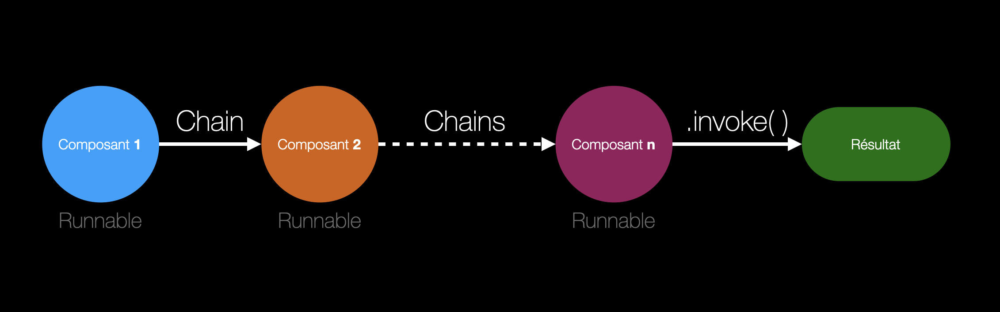

# Runnable Chains - LangChain

**LangChain** permet d'enchaîner facilement différents composants de traitement dans un
**pipeline unifié**. Ces composants — qu'il s'agisse d'un **prompt**, d'un **modèle de langage**
ou d'un **outil externe** — sont tous traités comme des `Runnable`, c'est-à-dire des
**blocs interopérables pouvant être connectés les uns aux autres**.

Grâce à cette architecture, il devient simple de construire des chaînes logiques de traitement
par exemple :

> **générer un prompt** → **l'envoyer à un LLM** → **interpréter la réponse** →
> **puis appeler une API ou une fonction locale**

C'est avec le ***LangChain Expression Language*** (LCEL) que nous pouvons chaîner les composants
via l'opérateur `|` (le pipe) et d'exécuter le tout de manière uniforme avec `.invoke()`.

Grâce aux `chains`, nous pouvons résumer **Langchain** à ceci :

> Boîte à outils pour créer des pipelines modulaires, réutilisables et traçables autour des
> modèles de langage.

## 1. Chargement du modèle LLM local

Dans cette section, nous chargeons un modèle de langage local grâce à **Ollama**. Cela permet
de travailler avec un **LLM directement sur notre machine**, sans connexion à une API externe.

Nous utilisons ici la classe `ChatOllama` de **LangChain**, qui nous permet d'interagir
facilement avec un modèle comme llama3 déjà téléchargé via Ollama.

## 2. Chaîne basique

Une chaîne de traitement simple peut être construite en combinant un prompt structuré avec un
modèle de langage à l'aide du système de chaînage de LangChain.
Ce type de chaîne permet de créer un dialogue en définissant plusieurs rôles (comme system et
human) et en injectant dynamiquement des valeurs dans le prompt.

### 🧩 Exercices

> Exercice 1

Créez un prompt qui demande à un modèle de définir un mot donné, dans un style pédagogique.

1. Utilisez ChatPromptTemplate.from_messages() pour définir un prompt structuré avec :

- un message system : l'IA est un professeur d'un domaine particulier qui explique simplement.
- un message human : l'utilisateur demande la définition d'un mot particulier.

1. Relie ce prompt à un modèle avec l'opérateur |.
2. Utilise .invoke() pour tester le prompt avec plusieurs disciplines et thèmes différents.

## 3. Chaîne étendue (séquence de runnables)

L'un des atouts majeurs de LangChain réside dans son système de **chaînes composables**, où
chaque composant du pipeline est un `Runnable`. Grâce à l'opérateur `|`, on peut enchaîner
autant d'étapes de traitement que voulu.

### 3.1 Runnable built-in

### 3.2 Runnable custom

Langchain offre non seulement d'utiliser des composants prédéfinis (LLMs, parsers, prompts…)
comme évoqué précédemment, mais aussi de définir facilement ses propres blocs de traitement.

Grâce à la classe `RunnableLambda`, on peut transformer n'importe quelle fonction Python en un
maillon de la chaîne. Cela ouvre la porte à un nombre infini de transformations : nettoyage de
texte, post-traitement, extraction de données, formatage, journalisation, etc.

### 🧩 Exercices

> Exercice 1

Créez un pipeline qui répond à des questions clients ou formule des messages marketing.
Il faut que ces réponses soient :

- stylisées,
- enrichies,
- adaptées à différents formats de publication.

## 4. Chaînes parallèles

### 4.1 Chaînes parallèles avec post-traitement externe

Dans LangChain, il est possible d'exécuter plusieurs **chaînes de traitement en parallèle** à
l'aide du composant `RunnableParallel`. Cela permet, par exemple, d'effectuer plusieurs
opérations indépendantes

### 4.2 Chaînes parallèles avec post-traitement intégré dans la chaîne

Pour éviter de manipuler manuellement les résultats (comme result["add"] ou result["substract"]),
il est possible d'ajouter un bloc de post-traitement directement à la fin de la chaîne parallèle
grâce à RunnableLambda.

Cette approche permet de :

- structurer la sortie de manière centralisée,
- intégrer la logique métier ou d'affichage directement dans le pipeline.

C'est une bonne pratique lorsqu'on souhaite rendre une chaîne modulaire, maintenable et
réutilisable dans un système plus large (ex. : API, application, chatbot…).

### 🧩 Exercices

> Exercice 1

Construire une mini-analyseur de texte. À partir d'un même paragraphe, nous voulons :

- Résumer le texte
- Extraire les mots-clés
- Détecter la langue
- Analyser le sentiment

Vous pouvez suivre ce schéma :

1. Créer les prompts
2. Créer les chaînes
3. Assembler les chaînes
4. Préparer les inputs
5. Lancer le traitement et afficher les résultats

## 5. Branches conditionnelles

Il est possible de définir des chemins conditionnels dans un pipeline, on parle alors de branche
conditionnelle.

Grâce à `RunnableBranch`, il est possible de router dynamiquement la sortie d'un composant
(comme un LLM) vers différents traitements en fonction de son contenu ou de n'importe quelle
règle métier.

Dans l'exemple qui suit :

1. On demande au LLM de calculer le double d'une valeur et de retourner uniquement un résultat
   numérique brut.
2. On analyse ce résultat :

- Si le résultat est supérieur ou égal à 100, on le met en majuscules et on affiche un message
  adapté.
- Sinon, on l'affiche en minuscules avec un message différent.

1. Tout cela est encapsulé dans une chaîne principale.

Ce mécanisme est extrêmement utile pour adapter dynamiquement le comportement d'une IA à
différents contextes : affichage, règles métier, logique métier avancée ou traitements
spécialisés.

### 🧩 Exercices

> Exercice 1

Sur une fiche produit e-commerce, les clients laissent des commentaires variés. L'objectif est
de construire une chaîne intelligente capable de répondre à chacun de ces commentaires de
manière empathique et appropriée, sans intervention humaine.

Construire une chaîne LangChain **entièrement automatisée**, dans laquelle un modèle de langage
(LLM) :

1. Analyse un commentaire client brut,
2. Détecte la tonalité du message (positive, negative, neutral),
3. Et génère une réponse adaptée, en sélectionnant dynamiquement le bon ton de réponse via un
   branchement conditionnel (RunnableBranch).

**Exemple :**

"J'ai bien reçu le produit, mais l'emballage était abîmé."

➡️ Le LLM doit détecter un sentiment négatif, puis router vers une réponse du type :

"Nous sommes désolés d'apprendre cela. Pourriez-vous nous donner plus de détails ou contacter
notre support afin que nous puissions résoudre le problème ?"

💡 **Pour vous aider, vous pouvez suivre ces étapes :**

1. Création d'une première chaîne : un prompt demande au LLM d'analyser un commentaire client
   et de retourner uniquement le sentiment (positive, negative, neutral).
2. Création de trois fonctions (ou RunnableLambda) :

- Pour répondre positivement : remercier et encourager.
- Pour répondre à un avis négatif : exprimer des regrets, demander plus de détails ou proposer
  de contacter le support.
- Pour un avis neutre : offrir son aide et demander si le client souhaite en savoir plus.

1. Utilisation de RunnableBranch pour appliquer le bon traitement selon le sentiment détecté.
2. Regrouper le tout dans une chaîne complète :

- Entrée : un commentaire client (texte brut)
- Sortie : une réponse adaptée au ton détecté.
